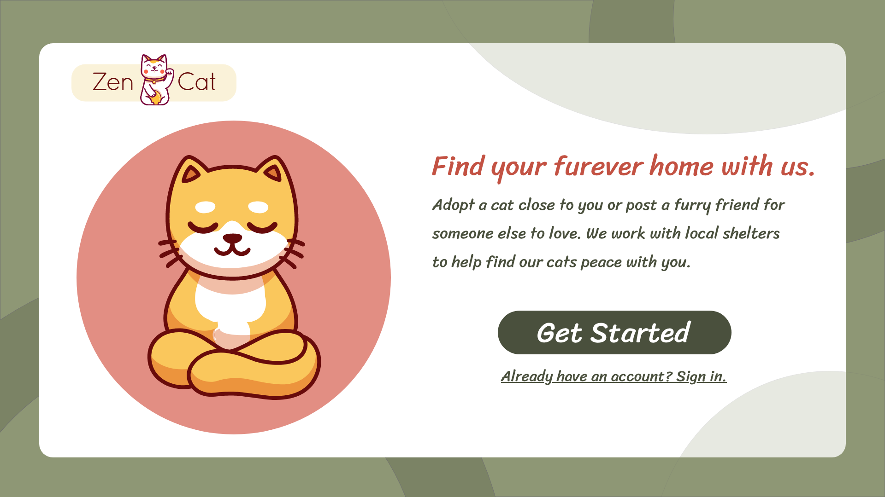
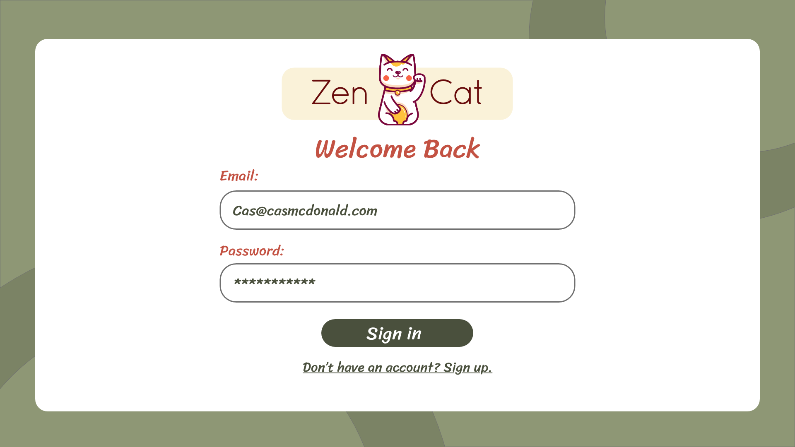
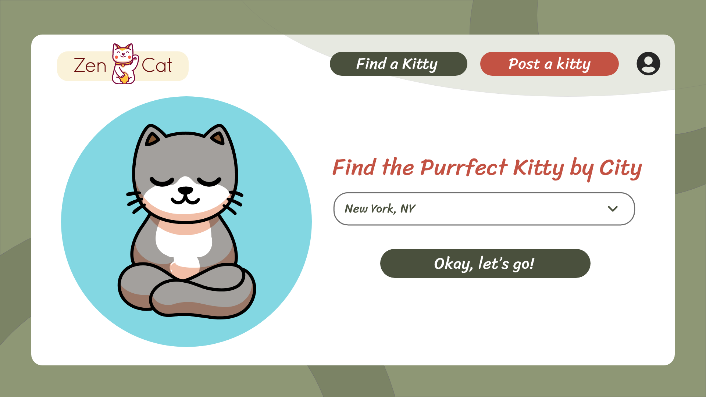
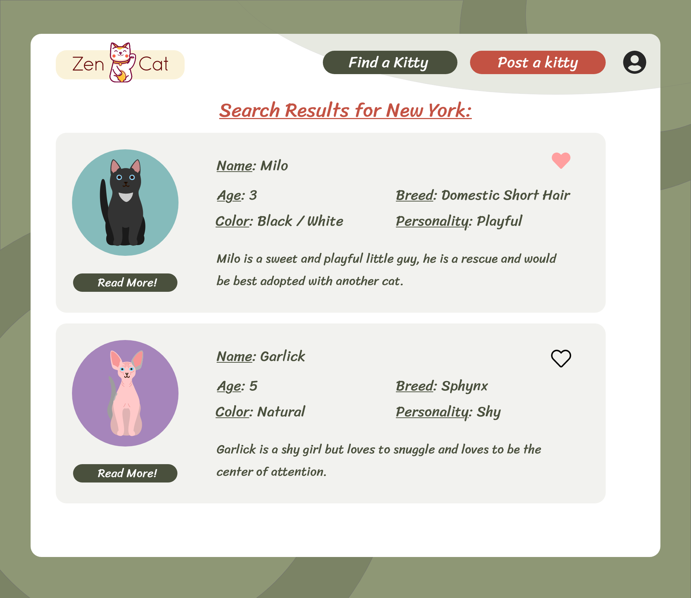
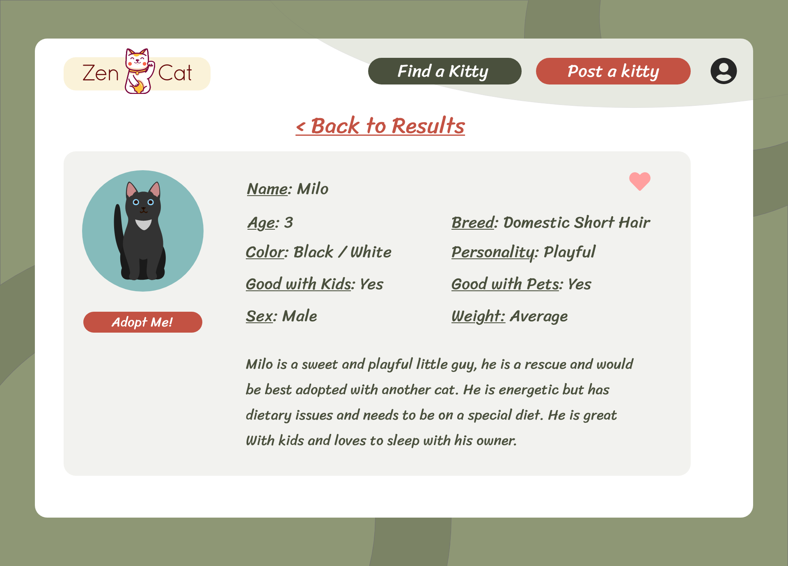
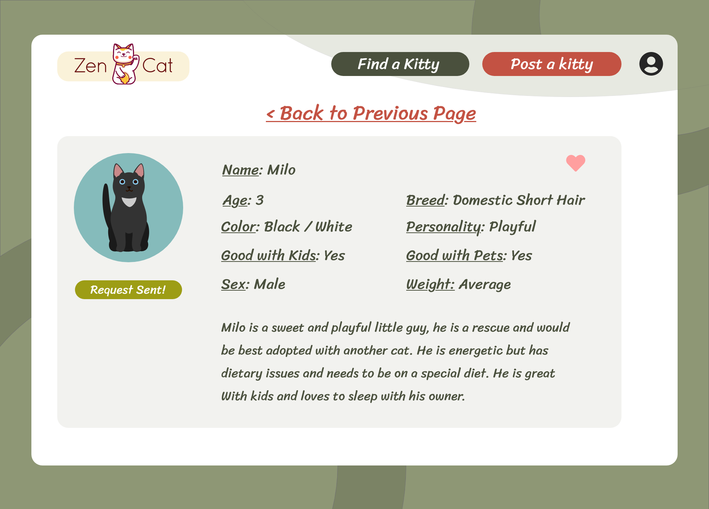
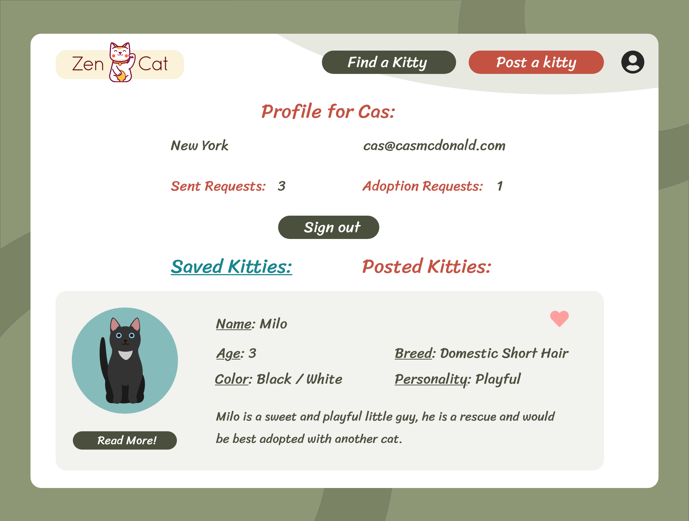
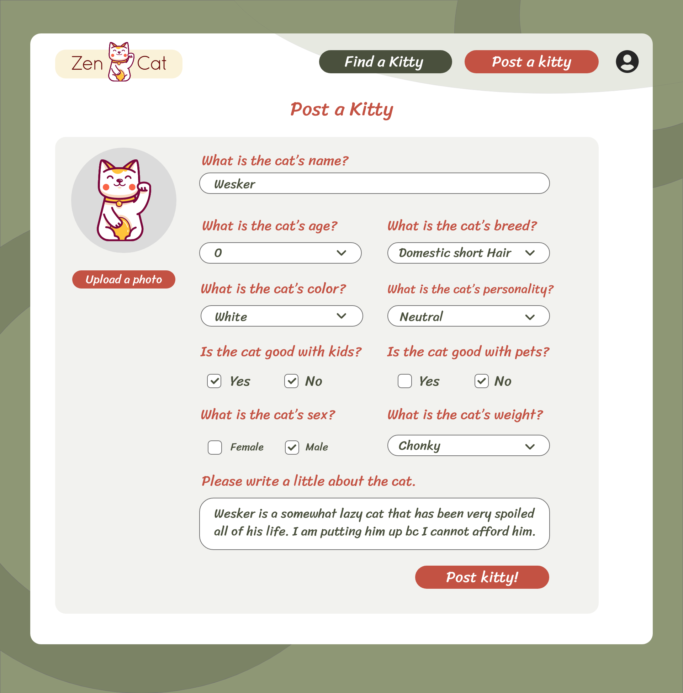
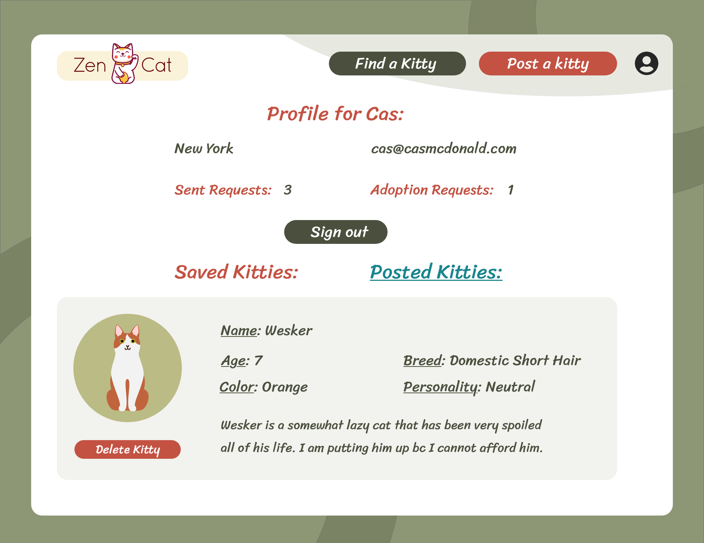

# Table of Contents:
* [Project Description](#Project)
* [Deployed Links](#Links)
* [Usage](#Usage)
* [Credits](#Credits)
* [License](#License)

# Project:
## Title:
# Kitty-Adoption-App

## Description:
A React JS app for Adopting and posting kitties up for adoption! 😻😺😸😽

I worked by myself on this project. I did all the UX/ UI Design. I am using the following technologies: Sequelize ORM, Node, Express, HTML/CSS, JS, React for client side rendering.

## User Story

```
AS A KITTY LOVER who frequently wants to save cats
I WANT an application
SO THAT I can easily adopt all the kitties in my region or post kitties up for adoption.
```

## Acceptance Criteria

```
Must use ReactJS in some way (even if minimal)
Must use a Node and Express Web Server
Must be backed by a MySQL or MongoDB Database with a Sequelize or Mongoose ORM  
Must have both GET and POST routes for retrieving and adding new data
Must be deployed using Heroku (with Data)
Must utilize at least two libraries, packages, or technologies that we haven’t discussed
Must allow for or involve the authentication of users in some way
Must have a polished frontend/UI
Must have folder structure that meets MVC Paradigm
Must meet good quality coding standards (indentation, scoping, naming)
Must not expose sensitive API key information on the server
```

## Config
Please add your user name and password to the config file. You will need an API key from rawg.io in the service layer to perform searches.Also install npm packages needed to run this program.

## Deployed Heroku Link
coming soon

## Youtube Demo
coming soon

## Link to Github
https://github.com/Defy1x/Kitty-Adoption-App

## Link to Adobe High Fidelity Wireframes (Desktop)
https://xd.adobe.com/view/88a878fb-07d2-4bcd-8b87-2634bb5cef18-ddfb/

## Link to Presentation and Case Study
https://uxfol.io/project/034c63f3/Zen-Cat-Kitty-Adoption-App-using-React

#Usage
## Final screenshot











#Credits
Thank you to everyone in the Columbia Engineering Bootcamp.

#License
MIT License

Copyright (c) 2021 Casandra McDonald

Permission is hereby granted, free of charge, to any person obtaining a copy
of this software and associated documentation files (the "Software"), to deal
in the Software without restriction, including without limitation the rights
to use, copy, modify, merge, publish, distribute, sublicense, and/or sell
copies of the Software, and to permit persons to whom the Software is
furnished to do so, subject to the following conditions:

The above copyright notice and this permission notice shall be included in all
copies or substantial portions of the Software.

THE SOFTWARE IS PROVIDED "AS IS", WITHOUT WARRANTY OF ANY KIND, EXPRESS OR
IMPLIED, INCLUDING BUT NOT LIMITED TO THE WARRANTIES OF MERCHANTABILITY,
FITNESS FOR A PARTICULAR PURPOSE AND NONINFRINGEMENT. IN NO EVENT SHALL THE
AUTHORS OR COPYRIGHT HOLDERS BE LIABLE FOR ANY CLAIM, DAMAGES OR OTHER
LIABILITY, WHETHER IN AN ACTION OF CONTRACT, TORT OR OTHERWISE, ARISING FROM,
OUT OF OR IN CONNECTION WITH THE SOFTWARE OR THE USE OR OTHER DEALINGS IN THE
SOFTWARE.
